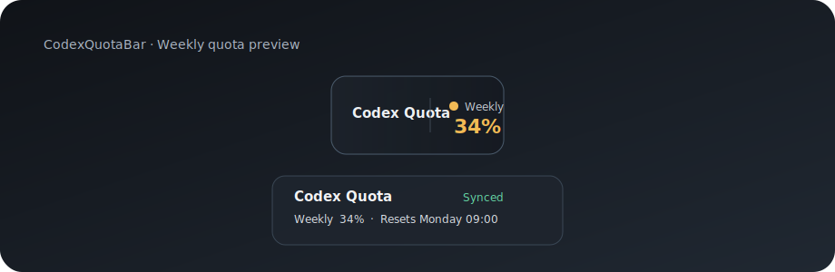

# Codex Quota Bar

[English](README.md) · [中文](README.zh-CN.md)

一个轻量的 Windows 桌面浮条，用于显示 Codex 的每周剩余额度，并在额度偏低时给出清晰预警。



## 功能

- 通过本机 Codex CLI 的只读 `app-server` JSON-RPC 获取每周额度与重置时间。
- 只有 Codex 桌面窗口处于前台时显示，切换到其他应用后隐藏。
- 柔雾玻璃深色界面，搭配低存在感边框、悬停高亮、状态点和紧凑进度线。
- 点击浮条展开详情面板，查看重置时间、同步状态并手动同步。
- 剩余额度低于 20% 显示黄色，低于 10% 显示红色。
- 启动前自动清理旧实例，避免重复浮条。
- 可选 Windows 登录自启。

## 环境要求

- Windows 10 或 Windows 11
- Windows PowerShell 5.1
- 已安装并登录官方 Codex CLI

如果 PowerShell 拦截 `codex`，请使用：

```powershell
codex.cmd login
codex.cmd login status
```

尚未安装 CLI 时：

```powershell
npm.cmd install -g @openai/codex
```

## 启动

双击 `Start-CodexQuotaBar.cmd`，或运行：

```powershell
.\Start-CodexQuotaBar.cmd
```

## 设置登录自启

```powershell
powershell.exe -NoProfile -ExecutionPolicy Bypass -File .\Install-Autostart.ps1
```

移除自启：

```powershell
powershell.exe -NoProfile -ExecutionPolicy Bypass -File .\Install-Autostart.ps1 -Remove
```

## 验证额度连接

```powershell
powershell.exe -NoProfile -ExecutionPolicy Bypass -File .\CodexQuotaBar.ps1 -CheckRpc
```

## 隐私与安全

- 只启动 `codex -s read-only -a untrusted app-server`。
- 不读取浏览器 Cookie，不保存密码、OAuth token 或 API key。
- 不直接调用网页私有额度接口，凭证由已登录的本机 Codex CLI 管理。

## 文件

| 文件 | 用途 |
| --- | --- |
| `CodexQuotaBar.ps1` | 浮条界面、前台检测、RPC 同步与交互 |
| `Start-CodexQuotaBar.cmd` | 清理旧实例并启动浮条 |
| `Stop-Existing-CodexQuotaBars.ps1` | 清理重复实例 |
| `Launch-CodexQuotaBar.vbs` | 无控制台窗口启动 |
| `Install-Autostart.ps1` | 添加或移除登录自启 |
| `assets/codex-quota-bar-example.svg` | README 示例图片 |

## 排错

如果 `-CheckRpc` 提示未登录，请重新运行 `codex.cmd login` 并完成浏览器授权。

如果浮条不显示，请先打开 Codex 桌面窗口，再运行 `Start-CodexQuotaBar.cmd`。
